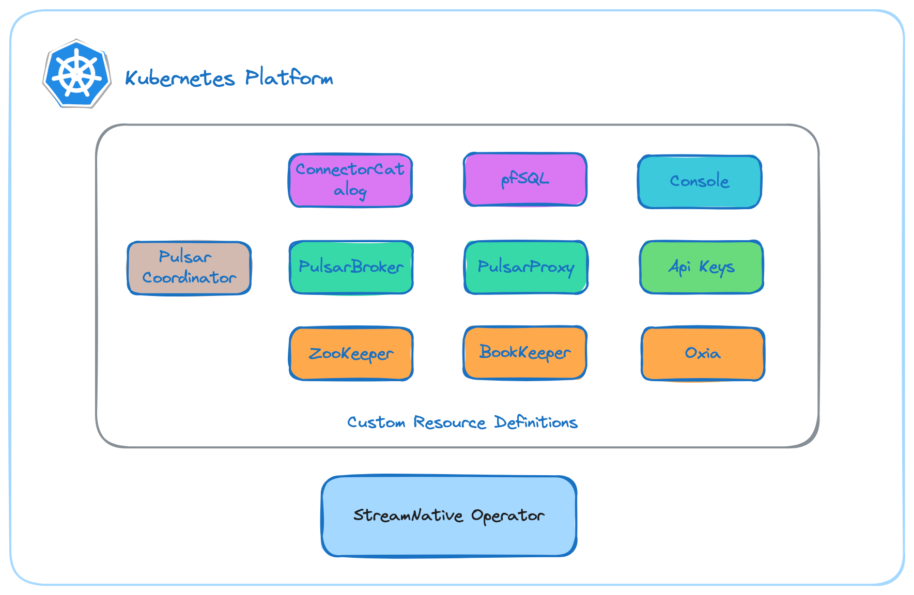

# Getting Started with StreamNative Private Cloud

This repository contains a c ollection of instructions the guide you through the process
of installing StreamNative's Private Cloud offering.

StreamNative Private Cloud is an enterprise product which brings specific controllers for Kubernetes by 
providing specific Custom Resource Definitions (CRDs) that extend the basic Kubernetes orchestration capabilities 
to support the setup and management components of:

- **Pulsar Coordinator**: manages an entire pulsar cluster using the underlying APIs of ZooKeeperCluster, BookKeeperCluster, PulsarBroker, PulsarProxy. It provides cluster-wide high level configurations and reconciliations.
- **Pulsar Broker**: manages a set of brokers nodes of the same broker cluster
- **Pulsar Proxy**: manages a set of proxy nodes of the same proxy cluster
- **BookKeeper**: manages a set of bookie and recovery nodes of the same bookkeeper cluster
- **ZooKeeper**: manages a set of zookeeper nodes of the same zookeeper cluster
- **Console**: management console for the Pulsar resources like the Tenants, Namespaces, Topics, Subscriptions.
- **Api Keys**: A revocable JSON Web Tokens (JWTs) authentication service which allows you to create long-lived tokens and revoke them.
- **pfSQL**: a lightweight SQL-like tool that simplifies real-time data processing built on top of Pulsar functions.
- **Connector Catalog**: a catalog for function-mesh-worker-service to retrieve the list of connectors.
- **Oxia**: a scalable metadata store and coordination system that can be used as the core infrastructure to build large scale distributed systems.

Requirements
------------
- kubectl (v1.16 or higher), compatible with your cluster (+/- 1 minor release from your cluster).
- Helm (v3.0.2 or higher).
- Kubernetes cluster (v1.16 or higher).

Ensure you have allocated enough resources to Kubernetes: at least 8Gb.

Next Steps
------------
- Refer to the [streamnative-installation-guide.md](docs%2Fstreamnative-installation-guide.md) for instructions on how to deploy the cluster
- Checkout the [monitoring-and-console.md](docs%2Fmonitoring-and-console.md) guide for instructions on configuring monitoring, observability, and admin console access.
- Follow the [function-mesh-install-guide.md](docs%2Ffunction-mesh-install-guide.md) guide to install the Function Mesh.
- Refer to the [ververica-installation-guide.md](docs%2Fververica-installation-guide.md) guide to install Flink 

References
---
- [StreamNative Private Cloud Overview](https://docs.streamnative.io/private/private-cloud-overview)
- [Operator License](https://streamnative.io/community-licence)
